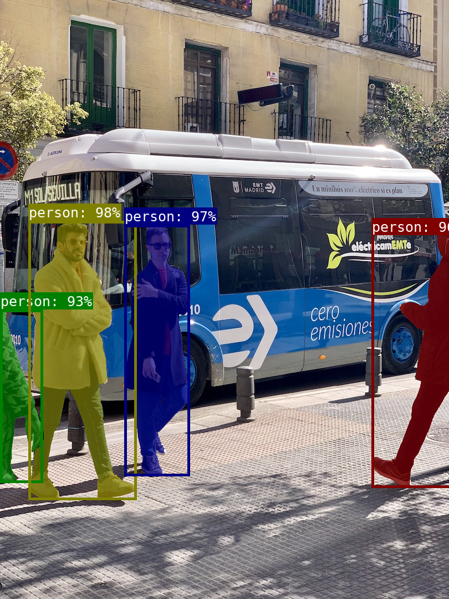
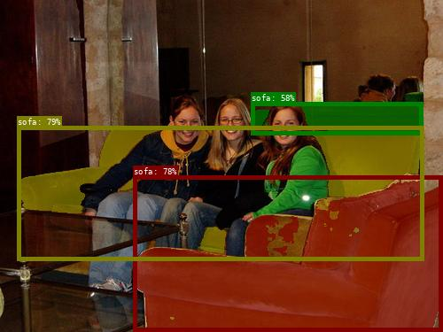
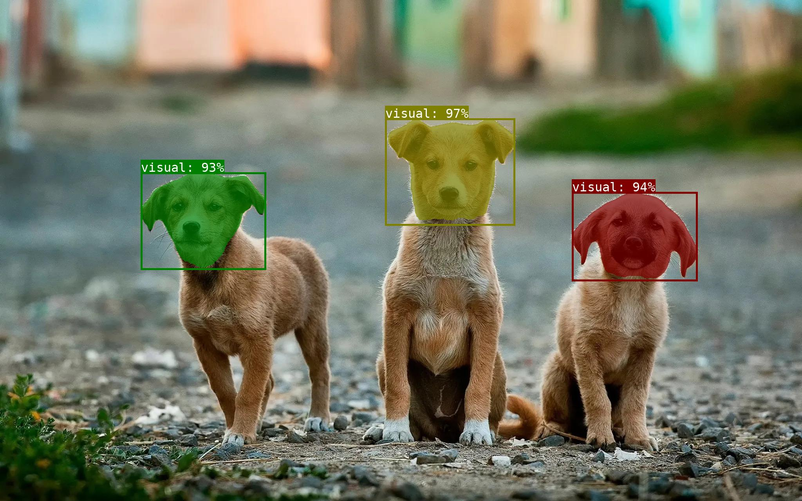
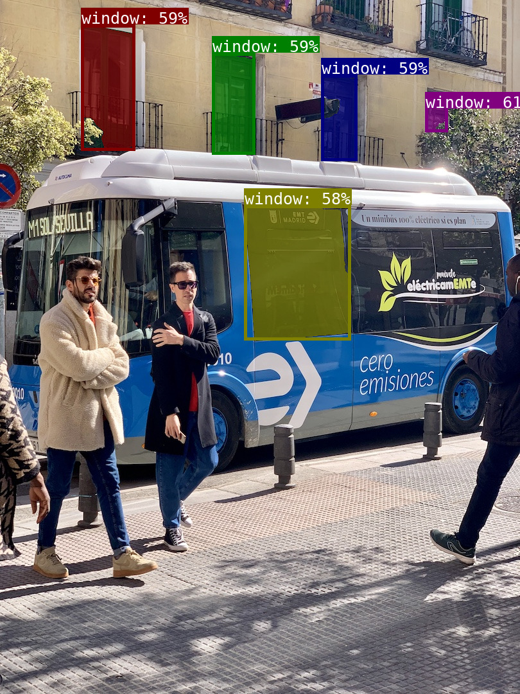
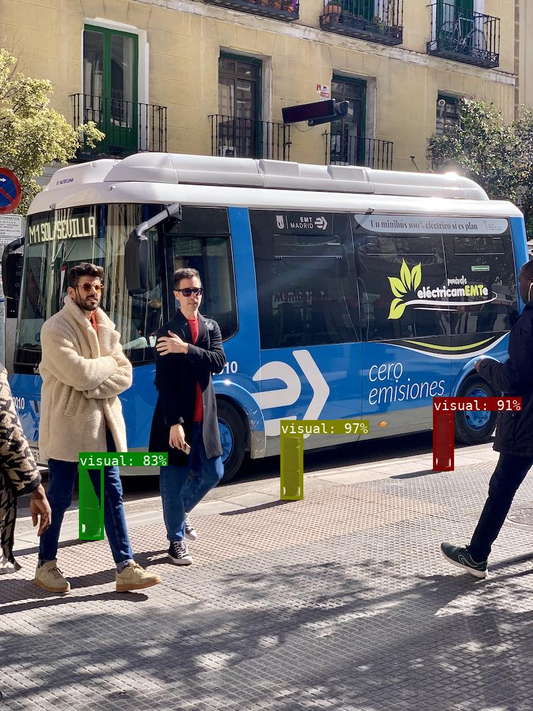
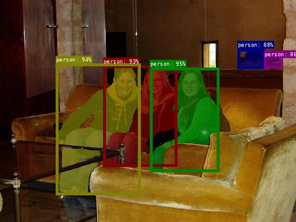
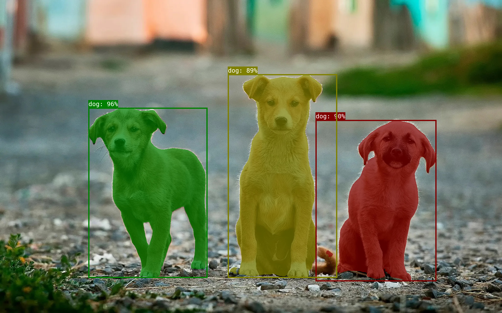
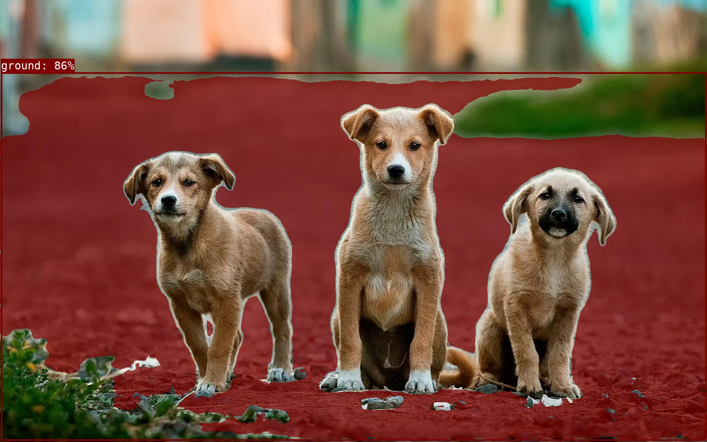

# sam3-onnx

[ONNX](https://onnx.ai/) export and inference for [SAM3](https://github.com/facebookresearch/sam3).

## Quick start

```sh
git clone https://github.com/wkentaro/sam3-onnx.git --recursive && cd sam3-onnx

uvx hf download wkentaro/sam3-onnx-models --local-dir models  # download pre-exported models

uv run --no-dev infer_onnx.py --image images/bus.jpg --text-prompt person
uv run --no-dev infer_onnx.py --image images/sofa.jpg --text-prompt sofa
uv run --no-dev infer_onnx.py --image images/dog.jpg --box-prompt  # opens a gui to select box
```

  

## Installation

```sh
git clone https://github.com/wkentaro/sam3-onnx.git --recursive && cd sam3-onnx
uv sync  # dev mode for exporting onnx unlike --no-dev
```

## Usage

**Inference with pytorch**

```sh
# with text prompt
uv run infer_torch.py --image images/bus.jpg --text-prompt person

# with box prompt
uv run infer_torch.py --image images/bus.jpg --box-prompt 0.548,0.658,0.043,0.095
uv run infer_torch.py --image images/bus.jpg --box-prompt  # opens a gui to select box
```

**Export to onnx**

```sh
# create models/*.onnx
uv run export_onnx.py

# upload to Hugging Face Hub
# uvx hf upload wkentaro/sam3-onnx-models models/ --include '*.onnx*'
```

**Inference with onnx**

```sh
# with text prompt
uv run infer_onnx.py --image images/bus.jpg --text-prompt person

# with box prompt
uv run infer_torch.py --image images/bus.jpg --box-prompt 0.548,0.658,0.043,0.095
uv run infer_torch.py --image images/bus.jpg --box-prompt  # opens a gui to select box
```

## Pre-exported ONNX models

If don't want to export yourself, download them from the [Hugging Face repo](https://huggingface.co/wkentaro/sam3-onnx-models):

```
models
├── sam3_decoder.onnx
├── sam3_decoder.onnx.data
├── sam3_image_encoder.onnx
├── sam3_image_encoder.onnx.data
├── sam3_language_encoder.onnx
└── sam3_language_encoder.onnx.data
```

## Examples

```sh
uv run infer_onnx.py --image images/bus.jpg --text-prompt person
uv run infer_onnx.py --image images/bus.jpg --text-prompt window
uv run infer_onnx.py --image images/bus.jpg --box-prompt 0.547,0.656,0.042,0.091  # select a block
```

  

```sh
uv run infer_onnx.py --image images/sofa.jpg --text-prompt person
uv run infer_onnx.py --image images/sofa.jpg --text-prompt sofa
```

 

```sh
uv run infer_onnx.py --image images/dog.jpg --text-prompt dog
uv run infer_onnx.py --image images/dog.jpg --text-prompt ground
uv run infer_onnx.py --image images/dog.jpg --box-prompt 0.561,0.342,0.167,0.217
```

  
